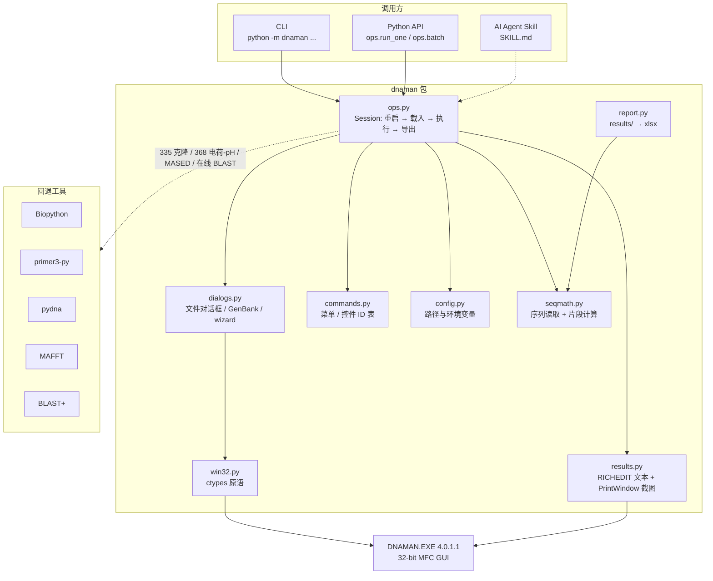

# dnaman-seq-analysis

[](https://github.com/aka-debug-jie/dnaman-seq-analysis/actions/workflows/tests.yml)
[](LICENSE)
[](pyproject.toml)
[](#环境要求)

> 用 Python 和 AI 代理驱动 **DNAMAN 4.0**（1990 年代的 Windows 分子生物学软件）：
> 酶切分析、引物设计、翻译/ORF、序列拼装、比对与蛋白工具；
> DNAMAN 做不到的部分自动回退到 Biopython / primer3-py / pydna / MAFFT / BLAST+。

[中文](#中文) · [English](#english) · [CHANGELOG](CHANGELOG.md) · [CONTRIBUTING](CONTRIBUTING.md) · [examples](examples/)

---

## 中文

### 这是什么

DNAMAN 4.0.1.1 是 1990 年代的经典 Windows 分子生物学软件，至今仍被许多实验室
用于酶切分析、引物设计与序列拼装，但它没有脚本接口。本项目通过 Win32 自动化
（pywinauto / ctypes）把 DNAMAN 变成可编程工具：

- **`dnaman` Python 包**：安全点击、对话框驱动、结果导出（文本 + 图片），
  带运行日志与失败清理；
- **AI Agent Skill**（`skills/dnaman-seq-analysis/SKILL.md`）：把菜单命令 ID、
  对话框控件 ID、踩坑经验教给 AI 代理（opencode / Claude Code 等），
  让代理也能驱动 DNAMAN；
- **Python 回退**：DNAMAN 做不到的环节（克隆连接、多序列比对、在线 BLAST 等）
  自动改用 pydna / MAFFT / BLAST+ / Biopython。

> 本项目**不包含、不分发 DNAMAN 软件本体**，使用前请自行合法安装 DNAMAN 4.0。

### 架构



`commands.py` / `config.py` / `report.py` / `seqmath.py` 不依赖 Win32，
可以在任何操作系统上导入和测试；其余模块首次访问时才加载，非 Windows 上会抛出
带说明的 `ImportError`。

### 功能

| 类别 | 内容 |
|---|---|
| 序列操作 | 载入 `.seq` / GenBank、碱基组成、反向/互补、翻译、ORF、重复序列、点阵图 |
| 限制性分析 | 酶切位点、限制性图谱、电泳模式图（线性/环状、多通道） |
| 引物 | PCR 引物设计、Tm、自互补/发夹、与模板互补性 |
| 高级 | 双序列比对、沉默突变分析、定点突变、图谱重建、序列组装 |
| 报告 | `results/` 汇总为 Excel（`report.py`）；Word 报告写法见 skill |
| 回退 | Biopython、primer3-py、pydna、MAFFT、BLAST+、pycirclize |

命令与控件的完整 ID 表、每个操作的实测行为、以及自动化踩坑规则，
统一维护在 **[`skills/dnaman-seq-analysis/SKILL.md`](skills/dnaman-seq-analysis/SKILL.md)**（唯一权威源），
本 README 不重复。

### 环境要求

- Windows（DNAMAN 是 32 位 Windows 程序）
- Python 3.9+（64 位 Python 可用，pywinauto 会给出 32 位提示，属正常）
- 已安装 DNAMAN 4.0

### 安装

```powershell
git clone https://github.com/aka-debug-jie/dnaman-seq-analysis.git
cd dnaman-seq-analysis
pip install -e .
# 可选：克隆/绘图/Word 报告依赖
pip install -e ".[all]"
```

### 配置

全部路径通过环境变量配置（不设置则自动探测 / 使用默认值）：

| 变量 | 含义 | 默认 |
|---|---|---|
| `DNAMAN_DIR` | DNAMAN 安装目录（含 `DNAMAN.EXE`） | 自动探测常见路径 |
| `DNAMAN_BASE` | 工作区根目录 | `~/DNAMAN` |
| `DNAMAN_WORK` | 工作目录 | `%DNAMAN_BASE%\work` |
| `DNAMAN_SEQ` | 序列目录 | `%DNAMAN_WORK%\seq` |
| `DNAMAN_RESULTS` | 结果目录 | `%DNAMAN_BASE%\results` |
| `DNAMAN_TOOLS` | 外部工具目录（BLAST+/MAFFT，可选） | `%DNAMAN_BASE%\tools` |
| `DNAMAN_LOGS` | 运行日志目录 | `%DNAMAN_WORK%\logs` |

```powershell
$env:DNAMAN_DIR = "C:\Program Files (x86)\DNAMAN"
python -m dnaman doctor        # 自检：应输出 ALL GOOD
```

### 快速开始

```powershell
python -m dnaman list                                   # 全部命令名 + 菜单 ID
python -m dnaman op --seq insert.seq --op restriction   # 酶切分析
python -m dnaman batch --seq insert.seq vector.seq --op composition orf
python -m dnaman pairwise --seq a.seq b.seq             # 双序列比对
python -m dnaman silent-mutation --seq gene.seq --start 698 --end 900
python -m dnaman directed-mismatch --seq gene.seq --position 781 --base G
python -m dnaman report                                 # results/summary.xlsx
```

```python
import os
from dnaman import ops, config

files = ops.run_one("insert.seq", "restriction",
                    outdir=os.path.join(config.RESULTS, "insert_restriction"),
                    options={"dialog": "Restriction Analysis",
                             "check": [1098, 1100, 1101, 1102]})  # circular+map+pattern
print(files)
```

`examples/` 里有可直接照着改的最小脚本。

### 给 AI 代理使用（Skill）

skill 位于 `skills/dnaman-seq-analysis/`，兼容 opencode 与 Claude Code 等支持
Agent Skills 的工具：

```powershell
python -m dnaman install-skill                  # opencode (~/.config/opencode/skills)
python -m dnaman install-skill --target claude  # Claude Code (~/.claude/skills)
python install_skill.py --force                 # 等价的历史入口
```

也可以手动把 `skills/dnaman-seq-analysis` 复制到对应目录。安装后重启代理会话，
提到 "DNAMAN / 酶切分析 / 引物设计 / 质粒图谱" 等关键词即可自动加载。

### 已知限制（摘要）

完整原因、复现条件与替代方案见 SKILL.md。

- **335 克隆** 需要交互式 DNA 图谱文档，无法从纯序列程序化驱动 → 回退 pydna；
- **368 电荷/pH** 结果字段是自定义控件，`GetWindowText` 读不到 → 回退 ProtParam；
- **347 沉默突变** 分析区域超过 ~200–300 bp 会使 DNAMAN 崩溃 → 缩小区域或用 348；
- **MASED 编辑器** 文本无法程序化复制；**在线 BLAST** 接口已失效 → 用本地 BLAST+；
- 每次分析需重启 DNAMAN（通道被占用时再次载入会静默失败）——包已自动处理。

### 开发与测试

```powershell
python -m unittest discover -s tests -v   # 26 项单测，不需要安装 DNAMAN
ruff check dnaman tests                   # 需要 ruff
```

测试拆成两份：`tests/test_platform_free.py`（18 项，任何系统都能跑）与
`tests/test_windows.py`（8 项，需要 Win32 层）。CI 在 GitHub Actions 上
同时跑 `windows-latest`（全量）和 `ubuntu-latest`（平台无关子集）。

### 许可证与免责声明

MIT License（见 `LICENSE`）。DNAMAN 是 Lynnon BioSoft 的商业软件，本项目与
其无关联、不包含其任何二进制文件；请自行获取合法授权。使用本自动化工具产生
的结果请自行核验。

---

## English

### What is this

DNAMAN 4.0.1.1 is a classic 1990s Windows molecular-biology application that is
still used for restriction analysis, primer design and sequence assembly, but
it has no scripting interface. This project turns it into a programmable tool
through Win32 automation (pywinauto / ctypes):

- **`dnaman` Python package** — safe async clicks, dialog driving, result export
  (text + figures), run logging and guaranteed cleanup;
- **AI agent skill** (`skills/dnaman-seq-analysis/SKILL.md`) — teaches menu
  command ids, dialog control ids and hard-won automation rules to agents such
  as opencode and Claude Code;
- **Python fallbacks** — steps DNAMAN cannot do (ligation, multiple alignment,
  online BLAST, ...) are delegated to pydna / MAFFT / BLAST+ / Biopython.

> This project does **not** include or distribute DNAMAN itself. Install your
> own licensed copy of DNAMAN 4.0.

See the [architecture diagram](#架构) above for how the pieces fit together.

### Requirements

Windows, Python 3.9+, a locally installed DNAMAN 4.0.

### Install

```powershell
git clone https://github.com/aka-debug-jie/dnaman-seq-analysis.git
cd dnaman-seq-analysis
pip install -e .
pip install -e ".[all]"   # optional: cloning / plotting / Word report deps
```

### Configure

| Variable | Meaning | Default |
|---|---|---|
| `DNAMAN_DIR` | DNAMAN install dir (contains `DNAMAN.EXE`) | auto-detected |
| `DNAMAN_BASE` | workspace root | `~/DNAMAN` |
| `DNAMAN_WORK` / `DNAMAN_SEQ` / `DNAMAN_RESULTS` / `DNAMAN_LOGS` | work, sequence, results and log dirs | under `DNAMAN_BASE` |
| `DNAMAN_TOOLS` | optional BLAST+/MAFFT directory | `%DNAMAN_BASE%\tools` |

```powershell
$env:DNAMAN_DIR = "C:\Program Files (x86)\DNAMAN"
python -m dnaman doctor
```

### Quick start

See the Chinese section above for CLI and Python examples; the interface is
identical. `python -m dnaman list` prints every supported operation.

### Skill for AI agents

```powershell
python -m dnaman install-skill                  # opencode (~/.config/opencode/skills)
python -m dnaman install-skill --target claude  # Claude Code (~/.claude/skills)
python install_skill.py --force                 # equivalent legacy entry point
```

### Known limitations

Cloning (335) needs an interactive map document → use pydna; charge/pH (368)
result fields are unreadable → use ProtParam; silent-mutation analysis regions
above ~300 bp crash DNAMAN; MASED editor text cannot be exported; online BLAST
is dead → use local BLAST+. Rationale and workarounds live in SKILL.md.

### Development

```powershell
python -m unittest discover -s tests -v   # 26 tests, no DNAMAN needed
ruff check dnaman tests
```

### License

MIT. DNAMAN is commercial software by Lynnon BioSoft; this project is not
affiliated with it and ships no DNAMAN binaries.
